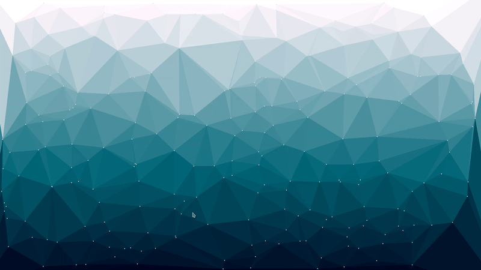
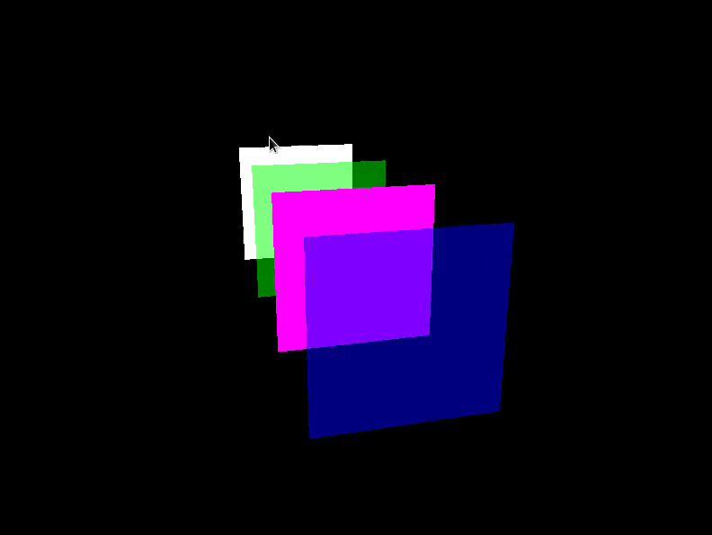

## Hi there 👋

I'm Agakitsune, I am an Epitech Student from L'ile de la Réunion (currently in my 4th year) and a Graphic Programmer (I least try to be one).

Here is some stuff I have made in my Epitech years

Particle System (C++, OpenGL)

Delaunay Triangulation screensaver (C++, OpenGL)

Bitmap Text rendering (C++, OpenGL)

<a href="https://casual-effects.blogspot.com/2014/03/weighted-blended-order-independent.html">Weighted Blended Order Independent Transparency </a>(C++, OpenGL)

Zappy Project with a Custom Renderer (C++, OpenGL)

 

